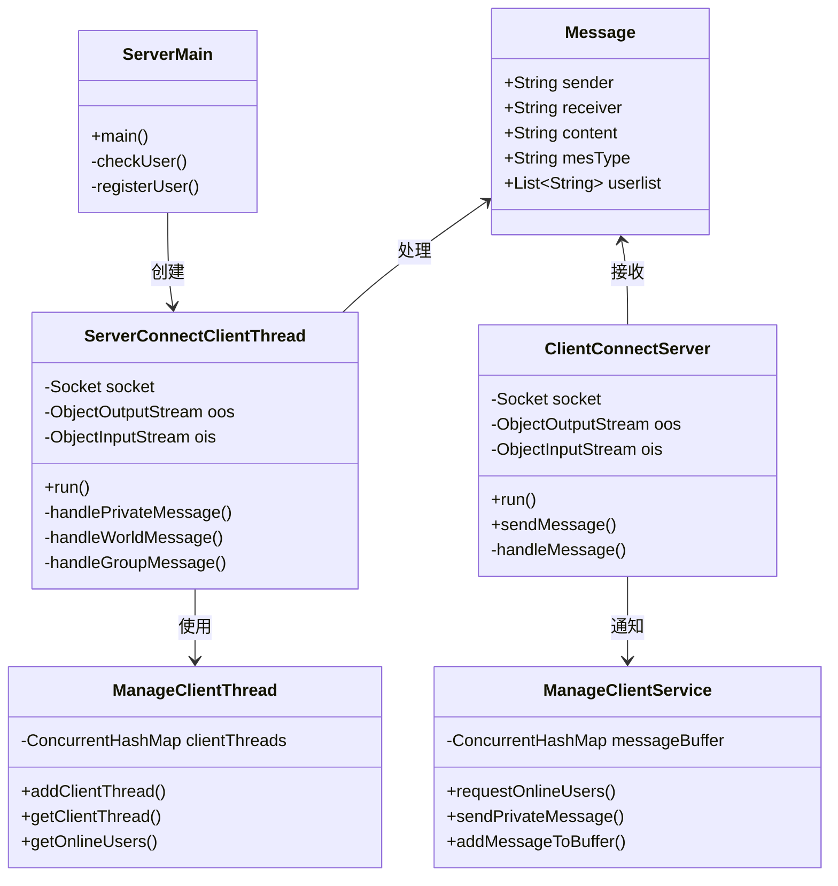

# 局域网聊天室系统 - 技术文档

## 项目概述

本项目是一个基于 Java Socket 的局域网聊天室系统，采用**C/S（客户端/服务器）架构**，实现了多用户实时通信功能。项目作为计算机网络课程的结课作业，重点展示了 TCP 协议在即时通讯场景中的应用。

### 核心技术栈

- **编程语言**: Java 21
- **网络通信**: Java Socket (TCP)
- **数据库**: MySQL + c3p0 连接池
- **UI 框架**: Java Swing
- **序列化**: Java ObjectInputStream/ObjectOutputStream

---

## 各类详细说明

### 一、公共模块 (common)

#### 1.1 Message.java - 消息实体类

**作用**: 所有网络通信的核心数据载体，采用**Builder 模式**构建消息对象。

```java
public class Message implements Serializable {
    private final String sender;      // 发送者ID
    private final String receiver;    // 接收者ID
    private final String content;     // 消息内容
    private final Date sendTime;      // 发送时间
    private final String mesType;     // 消息类型
    private final List<String> userlist;  // 用户列表（用于群聊）

    // 富文本样式
    private final String fontColor;   // 字体颜色
    private final boolean bold;       // 是否粗体
    private final int fontSize;       // 字号

    // 文件传输
    private final String fileName;    // 文件名
    private final byte[] fileData;    // 文件数据
}
```

**设计要点**:

- 实现`Serializable`接口，支持对象序列化通过网络传输
- 使用`final`字段保证消息不可变性
- Builder 模式使构建复杂消息更简洁

#### 1.2 MessageType.java - 消息类型常量

**作用**: 定义所有消息类型的常量接口，用于区分不同的业务请求。

```java
public interface MessageType {
    String MESSAGE_LOGIN = "请求登录";
    String MESSAGE_LOGIN_SUCCEED = "登录成功";
    String MESSAGE_LOGIN_FAIL = "登录失败";
    String MESSAGE_COMM_MES = "普通文字";           // 私聊
    String MESSAGE_WORLD_CHAT = "世界聊天";          // 广播
    String MESSAGE_GROUP_MES = "群聊消息";           // 群聊
    String MESSAGE_GROUP_CREATE = "创建群聊";        // 创建群
    String MESSAGE_GET_ONLINE_FRIEND = "获取在线列表";
    String MESSAGE_RET_ONLINE_FRIEND = "返回在线列表";
    String MESSAGE_CLIENT_EXIT = "请求退出";
    String MESSAGE_SHAKE = "窗口抖动";
    String MESSAGE_FILE = "文件传输";
    String MESSAGE_SYSTEM_BROADCAST = "系统广播";
    String MESSAGE_REGISTER = "请求注册";
    String MESSAGE_REGISTER_SUCCEED = "注册成功";
    String MESSAGE_REGISTER_FAIL = "注册失败";
}
```

#### 1.3 User.java - 用户实体类

**作用**: 封装用户基本信息，用于登录验证和用户信息展示。

```java
public class User implements Serializable {
    private String userID;    // 8位用户ID（唯一标识）
    private String nicname;   // 昵称
    private String password;  // 密码
    private String gender;    // 性别
}
```

---

### 二、服务端模块 (server)

#### 2.1 ServerMain.java - 服务端主入口

**作用**:

- 启动服务端 GUI
- 监听 8888 端口，等待客户端连接
- 处理登录和注册请求
- 为每个登录用户创建独立的通信线程

**核心流程**:

```
1. 创建 ServerSocket(8888)
2. 循环 accept() 等待连接
3. 接收第一条消息（登录/注册请求）
4. 验证用户身份
5. 若成功，创建 ServerConnectClientThread 处理后续通信
6. 广播在线用户列表给所有客户端
```

#### 2.2 ManageClientThread.java - 客户端线程管理器

**作用**:

- 维护所有在线用户的通信线程映射表
- 管理离线消息队列

```java
public class ManageClientThread {
    // 在线用户线程表：UserID -> 通信线程
    private static final ConcurrentHashMap<String, ServerConnectClientThread> clientThreads;

    // 离线消息缓存：UserID -> 消息列表
    public static Map<String, List<Message>> offlineMessages;

    // 添加/获取/移除线程的方法
    public static void addClientThread(String userId, ServerConnectClientThread thread);
    public static ServerConnectClientThread getClientThread(String userId);
    public static void removeClientThread(String userId);
    public static List<String> getOnlineUsers();
}
```

**设计要点**:

- 使用`ConcurrentHashMap`保证线程安全
- 离线消息在用户重新上线时推送

#### 2.3 ServerConnectClientThread.java - 服务端通信线程

**作用**:

- 每个在线用户对应一个线程实例
- 持续监听该用户的消息
- 根据消息类型分发处理

**线程工作流程**:

```java
@Override
public void run() {
    while (true) {
        Message msg = (Message) ois.readObject();  // 阻塞等待消息
        switch (msg.getMesType()) {
            case MESSAGE_COMM_MES:     handlePrivateMessage(msg);  break;
            case MESSAGE_WORLD_CHAT:   handleWorldMessage(msg);    break;
            case MESSAGE_GROUP_MES:    handleGroupMessage(msg);    break;
            case MESSAGE_GROUP_CREATE: handleGroupCreate(msg);     break;
            case MESSAGE_SHAKE:        handlePrivateMessage(msg);  break;
            case MESSAGE_FILE:         handlePrivateMessage(msg);  break;
            case MESSAGE_CLIENT_EXIT:  handleClientExit();         return;
        }
    }
}
```

**消息转发逻辑**:

| 消息类型 | 处理逻辑                            |
| -------- | ----------------------------------- |
| 私聊消息 | 查找接收者线程 → 直接转发           |
| 世界聊天 | 遍历所有在线线程 → 广播（除发送者） |
| 群聊消息 | 遍历群成员列表 → 定向转发           |
| 创建群聊 | 广播给所有群成员（含创建者）        |

#### 2.4 数据库层 (db/)

- **DBUtil.java**: 使用 c3p0 连接池管理数据库连接
- **UserDao.java**: 用户数据 CRUD 操作
  - `checkUserById(userId, pwd)`: 登录验证
  - `RegisterUser(...)`: 用户注册
  - `getUserById(userId)`: 获取用户详情

---

### 三、客户端模块 (client)

#### 3.1 ClientMain.java - 客户端主入口

**作用**:

- 启动登录界面
- 初始化与服务器的连接

#### 3.2 ClientConnectServer.java - 客户端通信线程

**作用**:

- 维护与服务器的 Socket 连接
- 持续接收服务器推送的消息
- 通过**监听器模式**通知 UI 组件

```java
public class ClientConnectServer extends Thread {
    private final Socket socket;
    private ObjectInputStream ois;
    private ObjectOutputStream oos;

    // 监听器列表
    private final List<OnlineUserListener> onlineUserListeners;
    private final List<PrivateMessageListener> privateMessageListeners;
    private final List<GroupCreateListener> groupCreateListeners;

    @Override
    public void run() {
        while (isRunning) {
            Message msg = (Message) ois.readObject();
            handleMessage(msg);  // 分发给对应监听器
        }
    }

    public void sendMessage(Message message) {
        oos.writeObject(message);  // 发送消息到服务器
    }
}
```

**监听器接口**:

```java
public interface PrivateMessageListener {
    void onMessageReceived(Message msg);
}

public interface OnlineUserListener {
    void onMessageReceived(Message msg);
}

public interface GroupCreateListener {
    void onGroupCreated(Message msg);
}
```

#### 3.3 ManageClientService.java - 客户端业务逻辑

**作用**:

- 封装发送消息的业务方法
- 管理消息缓存区（内存+文件持久化）

```java
public class ManageClientService {
    // 消息缓存：聊天对象 -> 消息列表
    private final ConcurrentHashMap<String, List<Message>> messageBuffer;
    private final ChatHistoryManager historyManager;

    public void requestOnlineUsers();       // 请求在线用户列表
    public void sendPrivateMessage(Message); // 发送任意消息
    public void sendExitRequest();          // 发送退出请求

    public void addMessageToBuffer(String key, Message msg);  // 缓存消息
    public List<Message> getMessages(String key);             // 获取历史消息
}
```

#### 3.4 视图层 (view/)

- **LoginView.java**: 登录界面，连接服务器并验证身份
- **RegisterDialog.java**: 注册对话框，创建新用户
- **MainChatView.java**: 主聊天界面
  - 三段式用户列表（个人信息/在线用户/群组）
  - 消息发送区域（支持富文本）
  - 聊天记录显示区域

#### 3.5 工具类 (utils/)

- **ChatHistoryManager.java**: 聊天记录序列化存储
- **SoundManager.java**: 音效播放（消息提示音等）
- **TrayManager.java**: 系统托盘管理
- **ScreenshotUtil.java**: 屏幕截图工具

---

## 通信设计（重点）

### 一、网络架构

```
┌──────────────┐                    ┌──────────────┐
│   客户端A    │                    │   客户端B    │
│              │                    │              │
│  ┌────────┐  │                    │  ┌────────┐  │
│  │ Socket │  │                    │  │ Socket │  │
│  └───┬────┘  │                    │  └───┬────┘  │
│      │       │                    │      │       │
└──────┼───────┘                    └──────┼───────┘
       │         TCP连接                   │
       │     ┌─────────────────┐          │
       └────►│   服务器        │◄─────────┘
             │                 │
             │  ServerSocket   │
             │    (8888)       │
             │                 │
             │  ┌───────────┐  │
             │  │线程管理器 │  │
             │  └───────────┘  │
             └─────────────────┘
```

### 二、TCP 连接建立流程

```
客户端                                          服务器
   │                                              │
   │  1. new Socket("127.0.0.1", 8888)           │
   │────────────────────────────────────────────>│
   │                                              │
   │  2. 服务器 accept() 接受连接                 │
   │<────────────────────────────────────────────│
   │                                              │
   │  3. 建立 ObjectOutputStream/ObjectInputStream │
   │<═══════════════════════════════════════════>│
   │                                              │
   │  4. 发送登录请求 (MESSAGE_LOGIN)             │
   │────────────────────────────────────────────>│
   │                                              │
   │  5. 返回登录结果 (LOGIN_SUCCEED/FAIL)       │
   │<────────────────────────────────────────────│
   │                                              │
   │  6. 双方启动通信线程                         │
   │<═══════════════════════════════════════════>│
```

### 三、对象序列化通信

本系统采用**Java 对象序列化**进行消息传输：

```java
// 发送消息
ObjectOutputStream oos = new ObjectOutputStream(socket.getOutputStream());
Message msg = new Message.Builder()
    .mesType(MessageType.MESSAGE_COMM_MES)
    .sender("12345678")
    .receiver("87654321")
    .content("Hello!")
    .build();
oos.writeObject(msg);  // 序列化并发送

// 接收消息
ObjectInputStream ois = new ObjectInputStream(socket.getInputStream());
Message receivedMsg = (Message) ois.readObject();  // 反序列化
```

**优点**:

- 自动处理复杂对象的序列化
- 类型安全，无需手动解析

**注意点**:

- 消息类必须实现`Serializable`接口
- 客户端和服务端的`Message`类必须完全一致

### 四、消息转发机制

#### 4.1 私聊消息

```
用户A                服务器                 用户B
  │                    │                      │
  │  MESSAGE_COMM_MES  │                      │
  │  receiver="B"      │                      │
  │───────────────────>│                      │
  │                    │                      │
  │                    │  查找B的线程         │
  │                    │  ServerConnectClient │
  │                    │  Thread              │
  │                    │────────────────────>│
  │                    │                      │
  │                    │  直接转发消息         │
  │                    │───────────────────>│
```

#### 4.2 世界聊天（广播）

```
用户A                服务器              所有在线用户
  │                    │                      │
  │ MESSAGE_WORLD_CHAT │                      │
  │───────────────────>│                      │
  │                    │                      │
  │                    │  遍历 clientThreads  │
  │                    │────────────────────>│
  │                    │                      │
  │                    │  转发给每个用户      │
  │                    │  （除发送者外）      │
  │                    │───────────────────>│ 用户B
  │                    │───────────────────>│ 用户C
  │                    │───────────────────>│ 用户D
```

#### 4.3 群聊消息

```
用户A                服务器              群成员(B,C)
  │                    │                      │
  │ MESSAGE_GROUP_MES  │                      │
  │ userlist=[A,B,C]   │                      │
  │───────────────────>│                      │
  │                    │                      │
  │                    │  遍历 userlist       │
  │                    │  跳过发送者A         │
  │                    │────────────────────>│
  │                    │                      │
  │                    │───────────────────>│ 用户B
  │                    │───────────────────>│ 用户C
```

### 五、线程模型

```
服务端:
┌────────────────────────────────────────────────────────┐
│  主线程                                                 │
│  └── ServerSocket.accept() 循环                        │
│       │                                                 │
│       ├── ServerConnectClientThread-1 (用户1)          │
│       ├── ServerConnectClientThread-2 (用户2)          │
│       └── ServerConnectClientThread-N (用户N)          │
└────────────────────────────────────────────────────────┘

客户端:
┌────────────────────────────────────────────────────────┐
│  主线程 (Swing EDT)                                    │
│  └── UI事件处理、消息显示                               │
│                                                         │
│  ClientConnectServer 线程                               │
│  └── 持续从服务器读取消息                               │
│       └── 通过监听器回调更新UI                          │
└────────────────────────────────────────────────────────┘
```

---

## 设计亮点

### 1. Builder 模式构建消息

避免构造函数参数过多，提高代码可读性。

### 2. 监听器模式解耦

通信线程与 UI 组件通过监听器解耦，便于扩展。

### 3. ConcurrentHashMap 保证线程安全

多线程环境下安全管理用户线程映射。

### 4. 离线消息机制

用户不在线时消息暂存，上线后自动推送。

### 5. 消息缓存+持久化

内存缓存加速读取，文件序列化保证记录不丢失。

---

## 附录：关键类关系图



---

## 参考资料

1. Java Socket 编程官方文档
2. TCP/IP 协议详解
3. Java 并发编程实战
4. Swing GUI 开发指南
